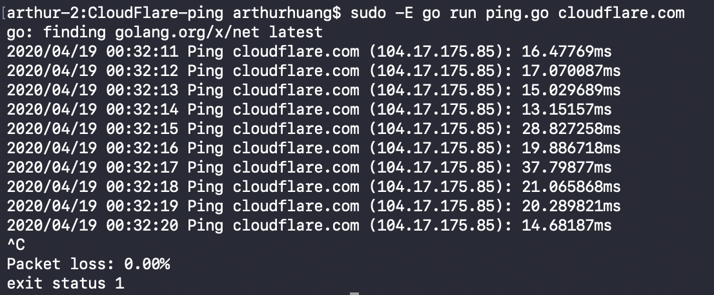
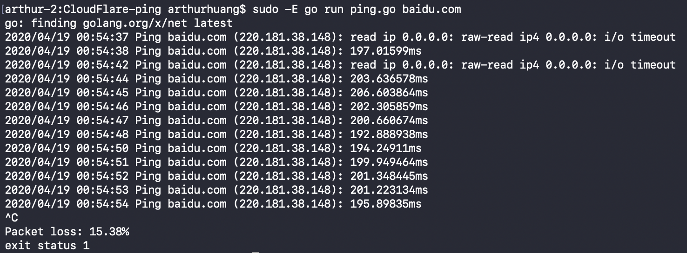

# CloudFlare-ping
A Ping program that accepts a hostname or an IP address as its argument, then send ICMP echo requests in a loop to the target while receiving echo reply messages.

## How to run the ping CLI app
Clone the repository. Enter the correct project folder. Then enter `sudo -E go run ping.go [target address]` Use `control + c` to stop program.

## Demo
* Pinging cloudfront.com

* Pinging a popular site in China

